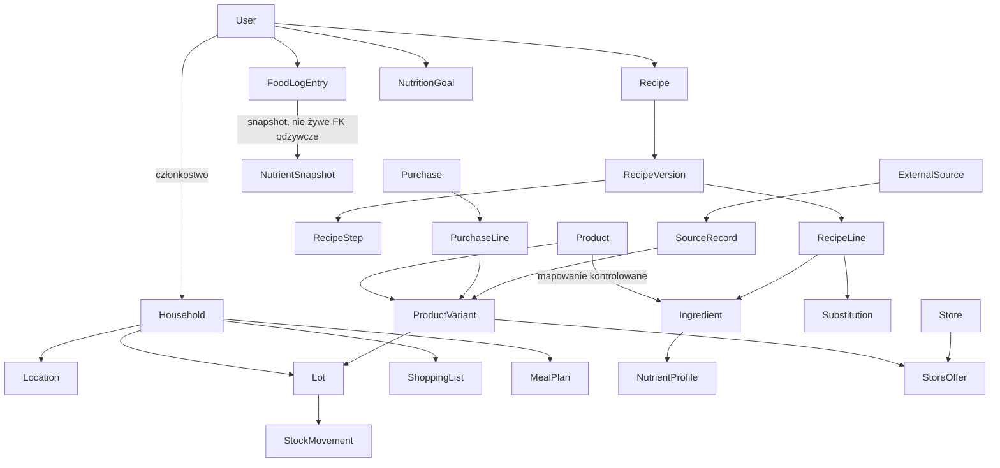

> **MATERIAŁ HISTORYCZNY — NIE JEST ŹRÓDŁEM PRAWDY**
>
> Ten plik pochodzi z wcześniejszego, **niezwiązanego** projektu koncepcyjnego („Przepisy Jacka”, Faza 0). Został zachowany wyłącznie jako artefakt historyczny.
>
> **Nie używaj** go do decyzji, nazw, zakresu, architektury ani reguł aplikacji **Moja Kuchnia**.
>
> Aktualne źródła prawdy:
> - `docs/product-scope.md`
> - `docs/architecture.md`
> - `docs/project-status.md`

# Przepisy Jacka — Faza 0: raport architektoniczny

Status: projekt koncepcyjny. Brak kodu aplikacji, migracji, szkieletu i zależności.
Data: 2026-08-24.
Repozytorium: `C:\Users\jacek_bbbkzut\Desktop\Przepisy Jacka`.

Ten dokument jest jedynym artefaktem Fazy 0. Nie stanowi jeszcze zatwierdzonej specyfikacji implementacyjnej.

---

## 1. Stan repozytorium i Git

| Pole | Wartość |
| --- | --- |
| Pełna ścieżka | `C:\Users\jacek_bbbkzut\Desktop\Przepisy Jacka` |
| Katalog roboczy Git | `C:/Users/jacek_bbbkzut/Desktop/Przepisy Jacka` |
| Gałąź | `main` (HEAD wskazuje `refs/heads/main`) |
| Commity | brak (`No commits yet`) |
| Remote | brak |
| Working tree | puste poza `.git` |
| `.git/config` | wyłącznie sekcja `[core]`; brak `remote`, `user`, `branch` |

Wniosek: repozytorium jest niezależne, lokalne i puste. Nie znaleziono powiązania z innymi projektami. Żadnych plików spoza tego katalogu nie odczytywano ani nie kopiowano.

Zakaz Fazy 0 został zachowany: brak instalacji zależności, szkieletu aplikacji, commita i publikacji.

---

## 2. Zrozumienie produktu

Przepisy Jacka to platforma do zarządzania **domową kuchnią, żywieniem i zakupami**, a nie klasyczna książka kucharska.

System ma trzech konsumentów jednego źródła prawdy:

1. aplikacja webowa (pełny interfejs, przeglądarka);
2. aplikacja Android (uproszczony interfejs, ten sam backend);
3. wspólny backend i wspólna baza.

Użytkownicy działają w **gospodarstwach domowych**. Prywatne dane są zawsze przypisane do osoby albo do gospodarstwa. Izolacja jest wymaganiem od pierwszego dnia, nawet jeśli pierwszym realnym tenantem będzie jedno gospodarstwo.

Wartość produktu wynika z kontrolowanego rozdzielenia pojęć, których typowe aplikacje kulinarne nie rozróżniają:

| Pojęcie | Przykład | Rola |
| --- | --- | --- |
| Składnik kanoniczny | mleko | język przepisów, zamienników i braków |
| Produkt | Mleko Łaciate 2% | marka i konkretna żywność |
| Wariant / opakowanie | 1 l, GTIN/EAN | jednostka skanowania i oferty |
| Partia w kuchni | otwarta butelka, data ważności, lokalizacja | stan magazynowy |
| Pozycja przepisu | 200 ml mleka | zapotrzebowanie na składnik |
| Pozycja zakupu | 2 sztuki konkretnego wariantu | fakt zakupowy |
| Oferta sklepowa | cena w konkretnym sklepie w czasie | handel |

Przepis mówi językiem składników. Kuchnia trzyma produkty i partie. Mostem jest **kontrolowane mapowanie produktu na składnik**.

Stan kuchni nie jest liczbą do nadpisania. Jest wynikiem operacji: zakup, zużycie, korekta, wyrzucenie, przeniesienie, upływ terminu. Zapisany posiłek trzyma snapshot wartości odżywczych, więc późniejsza korekta produktu nie fałszuje historii.

Dane z zewnątrz nigdy nie stają się „naszymi faktami” bez metadanych pochodzenia, identyfikatora źródła, czasu pobrania, statusu weryfikacji i możliwości ręcznej korekty.

---

## 3. Niejasności i konflikty w opisie

Poniższe punkty nie blokują Fazy 0, ale muszą być świadomie rozstrzygnięte przed implementacją. Tam, gdzie to bezpieczne, raport podaje rekomendację.

### 3.1 Katalog globalny kontra katalog gospodarstwa

Opis wymaga wielu niezależnych gospodarstw i jednocześnie katalogu składników oraz produktów, który naturalnie chce być współdzielony (kody kreskowe, Open Food Facts, wartości odżywcze).

Pełna izolacja katalogu per gospodarstwo unika wycieków, ale duplikuje mleko tysiące razy i psuje skanowanie. Czysto globalny katalog utrudnia prywatne produkty i ręczne korekty.

**Rekomendacja:** katalog platformowy (składniki, produkty, warianty) plus nakładka gospodarstwa (produkty prywatne, aliasy, preferowane mapowania, korekty). Stan kuchni, listy, plany i dziennik nigdy nie są globalne.

To jest decyzja blokująca — pytanie do właściciela w sekcji 14.

### 3.2 Własność: osoba czy gospodarstwo

„Wszystkie prywatne rekordy muszą być jednoznacznie przypisane do właściciela lub gospodarstwa” zostawia otwarty podział. Bez macierzy własności łatwo o wyciek albo o dziennik kalorii współdzielony między członkami rodziny wbrew intencji.

**Rekomendacja robocza:**

| Encja | Właściciel | Uzasadnienie |
| --- | --- | --- |
| Stan kuchni, lokalizacje, partie, ruchy | gospodarstwo | wspólna spiżarnia |
| Listy zakupów | gospodarstwo | wspólne zakupy |
| Plany posiłków | gospodarstwo | wspólne gotowanie |
| Przepisy | autor (użytkownik) z widocznością gospodarstwa lub prywatną | autorstwo + współdzielenie |
| Dziennik jedzenia | użytkownik | kalorie są osobiste |
| Cele kaloryczne i makro | użytkownik | cele są osobiste |
| Zakupy i paragony | gospodarstwo | wspólny budżet |
| Preferencje mapowania produktu | gospodarstwo | „u nas Łaciate = mleko 2%” |

### 3.3 Produkt, wariant i „konkretna żywność”

Opis oddziela produkt od opakowania, ale przykład „Mleko Łaciate 2% 1 l” jest jednocześnie produktem i wariantem. Kod kreskowy identyfikuje zwykle **SKU / opakowanie**, nie abstrakcyjną linię produktową.

**Rekomendacja:** trzypoziomowy model `Product` → `ProductVariant` (GTIN, netto, opakowanie) → `Lot`. Skanowanie i oferty siedzą na wariancie. Mapowanie na składnik może być na produkcie (gdy wszystkie warianty to to samo mleko) z możliwością wyjątku na wariancie.

### 3.4 Wartości odżywcze przepisu: żywe czy wersjonowane

Automatyczne wyliczanie kalorii przepisu koliduje z zakazem zmiany historycznych statystyk, jeśli przepis jest liczony „na żywo” z aktualnego katalogu.

**Rekomendacja:** przepis jest niemutowalny w ramach `RecipeVersion`. Wyliczenie odżywcze jest cache’owane na wersji. Nowa edycja tworzy nową wersję. Wpis dziennika kopiuje snapshot i nie zależy od późniejszych zmian katalogu ani przepisu.

### 3.5 Android offline kontra brak bezpośredniego dostępu do bazy

Offline na telefonie wymaga lokalnej repliki. To nie jest dostęp do PostgreSQL, tylko cache/projekcja API. Bez strategii synchronizacji łatwo o przypadkowy drugi source of truth.

**Rekomendacja:** web i pierwsze wydanie Androida są online-first. Lokalny cache tylko do odczytu (katalog, otwarta lista, bieżący stan). Zapis zawsze przez API. Konfliktów, kolejki offline i CRDT nie implementować, dopóki nie powstanie osobny dokument strategii sync.

### 3.6 Rekomendacje wymagają danych, których na starcie nie będzie

„Co mogę ugotować” da się zrobić ze stanu kuchni i przepisów. Koszt, promocje i limit kalorii wymagają cen i dziennika. Jeśli MVP obieca wszystkie kryteria, będzie wadliwe.

**Rekomendacja:** silnik rekomendacji od początku przyjmuje **niepełne dane** i pomija brakujące kryteria zamiast zgadywać. Koszt jest opcjonalnym sygnałem, nie warunkiem działania.

### 3.7 OpenAPI-client kontra `packages/contracts`

Generowany klient nie powinien być ręcznie uzupełniany typami domenowymi. Jeśli `contracts` zacznie dublować OpenAPI, powstanie drugi, rozjeżdżający się kontrakt.

**Rekomendacja:** OpenAPI jest źródłem prawdy dla HTTP. `packages/contracts` trzyma wyłącznie to, czego generator nie wyrazi: kody uprawnień, nazwy zdarzeń, stałe błędów biznesowych, ewentualnie branded types dla `Decimal`.

### 3.8 Next.js ma własne API, a backend ma być jedyny

App Router kusi `server actions` i Route Handlers z dostępem do bazy. To złamałoby zasadę jednego API dla webu i Androida.

**Rekomendacja:** Next.js nie zawiera logiki biznesowej ani dostępu do PostgreSQL. Ewentualny rewrite/proxy jest wyłącznie mostkiem sieciowym (ciasteczka, CORS), nie drugim backendem.

### 3.9 Licencja Open Food Facts kontra własny katalog i ceny

ODbL wymaga atrybucji i share-alike dla **pochodnej bazy**. Zmieszanie danych OFF z niepublicznymi cenami sklepowymi albo własnym „właściwym” katalogiem do redystrybucji tworzy ryzyko prawne.

**Rekomendacja:** warstwa provenance jest osobnym bounded context. Dane OFF pozostają oznaczone. Ceny i zakupy nigdy nie wchodzą do katalogu pochodzącego z OFF. Zrzut katalogu platformowego, jeśli kiedykolwiek publiczny, musi być licencjonowany świadomie.

### 3.10 Jednostki, gęstość i „szklanka”

Przepisy używają sztuk, szklanek i łyżek. Magazyn i etykiety używają gramów i mililitrów. Bez kanonicznej jednostki SI i tablicy konwersji wyliczenia odżywcze oraz zużycie stanu będą fałszywe.

**Rekomendacja:** przechowywać ilości jako `NUMERIC` plus jednostka. Przeliczenia do gramów/ml przez tablicę jednostek i opcjonalną gęstość składnika. Brak konwersji = brak automatycznego wyliczenia, nie ciche zgadywanie.

### 3.11 Inne otwarte napięcia, nieblokujące architektury

- Czy przepisy mają być kiedyś publicznym katalogiem społecznościowym, czy tylko zasobem gospodarstwa.
- Czy web też skanuje kody, czy skan jest cechą Androida.
- Strefa czasowa dat ważności: data kalendarzowa gospodarstwa, nie timestamp serwera.
- Czy „co mogę zjeść” obejmuje gotowe produkty, resztki i leftover posiłków, czy tylko przepisy.
- Czy pierwszy tenant to wyłącznie gospodarstwo autora, czy od razu produkt wielodostępny dla obcych osób.

---

## 4. Proponowana architektura

### 4.1 Kształt systemu

Modularny monolit TypeScript w monorepo. Jeden proces API, jedna baza, jasne moduły domenowe. Brak mikroserwisów.

```
[Web Next.js]          [Android Expo]
        \                  /
         \                /
          v              v
         [REST API NestJS + OpenAPI]
                    |
         +----------+-----------+
         |          |           |
    PostgreSQL   S3/MinIO   kolejka (później)
```

Klienty nie znają schematu bazy. Nie współdzielą komponentów UI. Współdzielą API, uwierzytelnianie i reguły biznesowe.

### 4.2 Struktura monorepo

```
apps/web            Next.js App Router — pełny klient HTTP
apps/api            NestJS — jedyny backend
apps/mobile         Expo / React Native — Android, nie w MVP
packages/api-client klient wygenerowany z OpenAPI
packages/contracts  wyłącznie to, czego nie da się bezpiecznie wygenerować
packages/config     ESLint, TypeScript, Prettier, commitlint
docs                decyzje i raporty faz
```

Narzędzie monorepo: **pnpm workspaces + Turborepo**. Uzasadnienie w sekcji 7.

### 4.3 Granice odpowiedzialności

| Warstwa | Wolno | Nie wolno |
| --- | --- | --- |
| `apps/web` | UI, routing, sesja przeglądarki, wywołania API | SQL, logika magazynu, mapowanie OFF |
| `apps/mobile` | uproszczone UI, skaner, lokalny cache | własny model domenowy, bezpośrednie S3 poza presigned URL |
| `apps/api` | autoryzacja, transkacje, wyliczenia, adaptery | renderowanie UI |
| `packages/api-client` | typy i wywołania HTTP | reguły biznesowe |
| PostgreSQL | fakty, RLS, NUMERIC | logika „którą lodówkę pokazać” w kliencie |

### 4.4 API

- REST, zasoby nazwane rzeczownikami domenowymi.
- OpenAPI 3.1 generowane z NestJS (`@nestjs/swagger` albo analog).
- Klient regenerowany w CI (`orval` albo `openapi-typescript` + lekkie wrappery).
- Wersjonowanie: `/v1`, kompatybilność wsteczna w obrębie wersji.
- Idempotencja na operacjach magazynowych i importach (`Idempotency-Key`).
- Błędy: stały kształt `{ code, message, details? }`; kody w `packages/contracts`.

### 4.5 Dane i zadania tła

- PostgreSQL 16+ jako jedyny system transakcyjny.
- S3-kompatybilny magazyn (lokalnie MinIO) na zdjęcia, paragony, surowe importy duże.
- Kolejka **dopiero** przy OCR, dumpach OFF, masowych przeliczeniach. W MVP wystarczą transakcje synchroniczne.
- Gdy kolejka powstanie: najpierw **pg-boss** na PostgreSQL. Redis/BullMQ dopiero przy realnym obciążeniu.

### 4.6 Precyzja liczb

JavaScript `number` jest zakazany dla ilości, pieniędzy i wartości odżywczych.

| Klasa | PostgreSQL | Aplikacja |
| --- | --- | --- |
| Ilość magazynowa / przepis | `NUMERIC(18,6)` | `Decimal` |
| Masa odżywcza (g / 100 g) | `NUMERIC(12,4)` | `Decimal` |
| Energia | `NUMERIC(12,2)` kcal oraz kJ albo kanonicznie kJ | `Decimal` |
| Pieniądze | `NUMERIC(19,4)` + kod waluty ISO | `Decimal` |
| Ułamki porcji | `NUMERIC(12,6)` | `Decimal` |

Waluta MVP: PLN. Daty ważności: `date` (kalendarz), nie `timestamptz`. Czas zdarzeń magazynowych: `timestamptz`.

---

## 5. Podział modułów domenowych

Moduły są granicami kompilacji i transakcji w monolicie NestJS, nie serwisami sieciowymi. Komunikacja między modułami: publiczne fasady / eventy wewnętrzne, nie sięganie do tabel sąsiada.

### 5.1 Moduły docelowe

| Moduł | Odpowiedzialność | Uwagi |
| --- | --- | --- |
| `Identity` | użytkownik, poświadczenia, sesje, weryfikacja e-mail | jedyny wydawca tożsamości |
| `Tenancy` | gospodarstwo, członkostwo, role, zaproszenia | każdy request ma kontekst tenant |
| `Catalog` | składnik, produkt, wariant, marka, jednostki, alergeny, wartości odżywcze katalogowe, mapowanie produkt→składnik | dane referencyjne + nakładki |
| `Inventory` | lokalizacje, partie, salda, ruchy magazynowe | saldo jest projekcją ruchów |
| `Recipes` | przepis, wersja, kroki, pozycje, zamienniki, zdjęcia, cache odżywczy wersji | niemutowalne wersje |
| `Nutrition` | cele, dziennik, snapshot posiłku | dane osobiste |
| `Planning` | plan posiłków, zaplanowane dania | gospodarstwo |
| `Shopping` | listy i pozycje, generowanie z planu i braków | bez cen w pierwszym wydaniu |
| `Procurement` | sklepy, oferty, historie cen, promocje, zakupy | faza późniejsza |
| `Ingestion` | źródła, joby importu, surowy payload, adaptery, weryfikacja | antykorupcja |
| `Media` | metadane obiektów S3, presigned URL | bez domeny żywieniowej |
| `Recommendations` | ranking „co ugotować / zjeść” | aplikacyjny, bez własnych tabel faktów |
| `Notifications` | terminy, braki, kanały | po MVP |
| `Analytics` | read-modele zużycia, wydatków, marnowania | wyłącznie z snapshotów i ruchów |

### 5.2 Grupowanie na start monolitu

W kodzie Fazy 1 nie trzeba tworzyć czternastu folderów. Wystarczą granice:

1. `Identity` + `Tenancy` (kernel dostępu)
2. `Catalog` + `Ingestion` (referencje i pochodzenie)
3. `Inventory`
4. `Recipes` + `Recommendations` (gotowanie)
5. `Nutrition` + `Planning` + `Shopping` — dopiero gdy kernel kuchni działa
6. `Procurement`, `Notifications`, `Analytics` — puste fasady albo brak kodu do swojej fazy

`Media` jest infrastrukturą współdzieloną, nie domeną żywieniową.

### 5.3 Zależności między modułami

Dozwolony kierunek:

```
Recommendations → Recipes, Inventory, Nutrition, Planning, Shopping, Catalog
Planning        → Recipes, Nutrition
Shopping        → Catalog, Inventory, Planning
Nutrition       → Catalog, Recipes
Inventory       → Catalog, Tenancy
Recipes         → Catalog
Procurement     → Catalog, Inventory (przyjęcie dostawy)
Ingestion       → Catalog
wszystkie prywatne → Tenancy, Identity
```

Zakaz: `Catalog` nie zna kuchni. `Inventory` nie zna cen. `Nutrition` nie zapisuje stanu magazynu (zużycie wywołuje `Inventory` przez fasadę, jeśli użytkownik oznaczy „zużyj ze stanu”).

---

## 6. Najważniejsze encje i relacje

### 6.1 Diagram pojęciowy



### 6.2 Katalog

**Ingredient** — kanoniczny byt żywnościowy (`mleko`, `cebula żółta`). Ma nazwę znormalizowaną, jednostki preferowane, alergeny, profil odżywczy referencyjny (per 100 g albo per 100 ml), gęstość opcjonalną.

**Brand**, **Product** — markowa żywność bez wymiaru opakowania.

**ProductVariant** — SKU: GTIN/EAN, ilość netto, jednostka netto, rodzaj opakowania. To jest obiekt skanowania.

**ProductIngredientMapping** — jawna relacja `variant|product → ingredient` z wagą/udziałem (domyślnie 1.0 dla produktu jednoskładnikowego), statusem (`proposed`, `verified`, `rejected`, `manual`) i źródłem. Produkty złożone (jogurt granola) mogą mapować się na wiele składników; MVP może ograniczyć się do mapowania 1:1 i oznaczać złożone jako „nieprzeliczalne automatycznie”.

**Unit**, **UnitConversion** — kanoniczne jednostki i przeliczniki. Konwersja bez danych = błąd, nie `1`.

**Allergen**, **NutrientDefinition** — słowniki stabilne.

Nakładka gospodarstwa: `HouseholdCatalogOverride` (prywatny produkt, alias, preferowany wariant, ręczna korekta odżywcza z provenance).

### 6.3 Magazyn

**Location** — spiżarnia, lodówka, zamrażarka, plus lokalizacje własne gospodarstwa.

**Lot** — egzemplarz/partia: wariant, lokalizacja, ilość bieżąca (projekcja), data ważności, status (`sealed`, `opened`, `expired`).

**StockMovement** — jedyne źródło prawdy ilości:

- `purchase`, `consume`, `adjust`, `discard`, `transfer`, `expire`, `recipe_consume`, `undo`

Ruch ma: `household_id`, `lot_id`, znakowaną ilość, jednostkę, aktora, czas, opcjonalne powiązanie (zakup, przepis, wpis dziennika), komentarz.

Zakaz: `UPDATE lots SET quantity = $n` jako operacja biznesowa. Aktualizacja projekcji wyłącznie w tej samej transakcji co wstawienie ruchu.

### 6.4 Przepisy

**Recipe** — tożsamość, autor, widoczność, aktualna wersja.

**RecipeVersion** — niemutowalny snapshot treści: porcje, czas, kroki, pozycje, wyliczone odżywcze, notatka skąd liczone.

**RecipeLine** — składnik, ilość, jednostka, opcjonalna przygotowanie (`posiekana`). Nie wskazuje partii ani GTIN.

**Substitution** — zamiennik składnika z przelicznikiem.

Zdjęcia przez `Media` i relację do przepisu/wersji.

### 6.5 Żywienie

**NutritionGoal** — energia i makro na dzień, per użytkownik, z okresem obowiązywania.

**FoodLogEntry** — kto, kiedy, jaki posiłek, porcja, **snapshot** makro/energii/alergenów, typ źródła (`recipe_version`, `product_variant`, `ingredient`, `manual`), identyfikatory źródła tylko jako ślad, nie jako żywe wyliczenie.

### 6.6 Plan i zakupy

**MealPlan** / **PlannedMeal** — dzień, slot, przepis lub pozycja ręczna, liczba porcji.

**ShoppingList** / **ShoppingListItem** — stan (`needed`, `bought`, `skipped`), składnik albo wariant, ilość. Generator tworzy pozycje z braków planu i ujemnego salda składnika; użytkownik może dodać ręcznie.

### 6.7 Handel (później)

**Store**, **StoreOffer**, **PricePoint**, **Promotion**, **Purchase**, **PurchaseLine**. Oferta nigdy nie jest produktem. Zakup może wygenerować ruchy `purchase` w magazynie, ale paragon nie jest stanem kuchni.

### 6.8 Pochodzenie

**ExternalSource** — `open_food_facts`, `manual`, `ocr_receipt`, …

**SourceRecord** — źródło, zewnętrzny id, czas pobrania, payload surowy (JSONB albo obiekt S3), hash, poziom zaufania, status weryfikacji, wskaźnik ręcznej korekty, powiązanie z encją kanoniczną.

Jedna encja katalogowa może mieć wiele rekordów źródłowych. Pole kanoniczne pamięta, które źródło jest aktualnie przyjęte.

---

## 7. Stos technologiczny, ORM, auth, monorepo

### 7.1 Ocena propozycji wyjściowej

Propozycja (Next.js, NestJS, Expo Android, OpenAPI, PostgreSQL, S3, REST, monolit) jest **trafna** dla tego produktu. Nie zamieniam jej na inny stos.

Zmiany względem briefu — tylko tam, gdzie jest konkretny powód:

| Temat | Brief | Decyzja Fazy 0 | Powód |
| --- | --- | --- | --- |
| ORM | nieustalone | **Drizzle** | RLS, `NUMERIC`, SQL magazynowy |
| Auth | nieustalone | **własny moduł w NestJS**, nie Auth.js | jeden backend dla webu i Androida |
| Monorepo | „rozważ” | **pnpm + Turborepo** | mniejszy narzut niż Nx na start |
| Kolejka | „dopiero na OCR” | potwierdzenie; **pg-boss** jako pierwsza kolejka | bez Redisa w MVP |
| `apps/mobile` | od początku | katalog planowany, **szkielet Expo dopiero w fazie mobilnej** | pusty Expo generuje koszt bez wartości |
| Next.js API | ryzyko ukryte | **zakaz logiki biznesowej w Next** | jedno API |
| Redis | często dokładany z przyzwyczajenia | brak w MVP | sesje i kolejka w PostgreSQL |

Nie rekomenduję Pythona, osobnego serwisu „AI”, GraphQL, MongoDB ani mikroserwisów.

### 7.2 ORM

| Kryterium | Prisma | Drizzle | MikroORM | TypeORM |
| --- | --- | --- | --- | --- |
| `NUMERIC` / Decimal | jest, bywa niewygodny | natywny SQL | dobry | słaby DX typów |
| PostgreSQL RLS + `SET LOCAL` | historycznie oporny | naturalny | możliwy | możliwy |
| Raporty magazynowe / agregacje | walka z DSL | SQL-first | umiarkowanie | surowy SQL i tak |
| Migracje | bardzo dobre | drizzle-kit, wystarczające | dobre | mieszane |
| DDD / agregaty | słabe | świadome, bez magii | najlepsze | słabe |
| Dojrzałość w NestJS | wysoka | wysoka i rosnąca | wysoka | spadająca |
| Ryzyko lock-in | silnik Prisma | niski | średni | średni |

**Wybór: Drizzle.** Ten produkt będzie żył na RLS, księgowości magazynowej i liczbach dziesiętnych. Bliskość SQL jest zaletą, nie kosztem.

Prisma jest rozsądna, jeśli priorytetem ma być maksymalna prędkość CRUD kosztem RLS. MikroORM ma sens przy twardym DDD z jednostką pracy — większy koszt zespołowy niż potrzeba na start. TypeORM nie jest rekomendowany dla nowego kodu.

### 7.3 Uwierzytelnianie

| Opcja | Zalety | Wady | Werdykt |
| --- | --- | --- | --- |
| Auth.js / NextAuth | szybki na Next | zły dla Nest + Android | odrzucony |
| Clerk / Auth0 | mało roboty | koszt, lock-in, trudniejsze RLS/session-local | za wcześnie |
| Keycloak / Authentik | dojrzały OIDC | za ciężki na MVP | faza późniejsza, jeśli pojawią się SSO firmowe |
| Passport + JWT w Nest | klasyczne | łatwo o słabe odświeżanie tokenów | dopuszczalne |
| **Sesje nieprzezroczyste w PostgreSQL + Nest** | jeden model dla webu i Androida, unieważnianie, RLS | trzeba napisać | **MVP** |

Model MVP:

- rejestracja e-mail + hasło (Argon2id);
- weryfikacja e-mail;
- sesja serwerowa w PostgreSQL;
- web: ciasteczko `HttpOnly`, `Secure`, `SameSite=Lax`, API za reverse proxy na tym samym site;
- Android: token dostępu krótkożyjący + refresh rotowany, przechowywany w `SecureStore`;
- CSRF tylko dla cookie;
- membership sprawdzane na każdym żądaniu; `household_id` z tokenu kontekstu, nie z zaufania do body.

OAuth Google / Apple: nieblokujące. Apple będzie potrzebne przy iOS, nie przy samym Androidzie. Passkeys — po stabilnym haśle.

### 7.4 Organizacja monorepo

| Opcja | Zalety | Wady | Werdykt |
| --- | --- | --- | --- |
| **pnpm + Turborepo** | prostota, cache, standard TS 2026 | mniej generatorów | **wybór** |
| pnpm + Nx | generatory, graf, affected | nadmiar na 2–3 apki | gdy monorepo spuchnie |
| npm workspaces | zero nauki | gorsza izolacja i dysk | nie |
| osobne repozytoria | twarde granice | duplikacja kontraktów, ból OpenAPI | sprzeczne z briefem |

`packages/api-client` jest artefaktem builda, nie miejscem ręcznej domeny.

---

## 8. Izolacja danych użytkowników

### 8.1 Model tenancy

Wspólny schemat PostgreSQL. Każda tabela z danymi prywatnymi ma dokładnie jednego właściciela:

- `household_id NOT NULL` albo
- `user_id NOT NULL` albo
- oba, gdy rekord jest osobisty, ale żyje w kontekście gospodarstwa (np. wpis dziennika zrobiony „w domu”).

Katalog platformowy: `household_id NULL` oznacza rekord współdzielony. Rekord z `household_id` to nakładka prywatna. Zapytania katalogu: `WHERE household_id IS NULL OR household_id = current_household()`.

Nie stosujemy osobnej bazy ani schematu per gospodarstwo. To przedwczesne i psuje wspólny katalog.

### 8.2 Obrona w głąb

1. **Uwierażytelnienie** — brak sesji = brak danych.
2. **Kontekst żądania** — `user_id` z sesji; `household_id` z nagłówka/ścieżki tylko po sprawdzeniu członkostwa.
3. **Guard członkostwa i ról** — `owner`, `member`, później `guest`.
4. **Zapytania zawsze z predykatem właściciela** — w Drizzle przez helper `tenant()`.
5. **RLS PostgreSQL** — `SET LOCAL app.user_id` / `app.household_id` na transakcję; polityki na wszystkich tabelach prywatnych; rola aplikacji bez bypass RLS.
6. **Testy IDOR** — próba odczytu/zapisu obcego `lot_id` / `recipe_id` musi kończyć się 404, nie 403 ze szczerością o istnieniu.
7. **Brak surowego SQL omijającego helper** w recenzji kodu.

RLS jest siatką bezpieczeństwa, nie usprawiedliwieniem leniwych zapytań.

### 8.3 Role początkowe

| Rola | Może |
| --- | --- |
| `owner` | wszystko w gospodarstwie, usunięcie, zaproszenia, przekazanie własności |
| `member` | kuchnia, przepisy gospodarstwa, listy, plany; nie usuwa gospodarstwa |
| `guest` (opcjonalnie później) | odczyt wybranych list / planu |

Dziennik i cele: zawsze tylko właściciel rekordu, nawet gdy `member` widzi stan lodówki.

### 8.4 Media

Obiekty S3 pod kluczem `household/{id}/...` albo `user/{id}/...`. Dostęp wyłącznie przez presigned URL po autoryzacji. Publiczne URL-e tylko dla jawnie opublikowanych zdjęć przepisów, jeśli taka funkcja powstanie.

---

## 9. Integracje, importy, pochodzenie

### 9.1 Zasada antykorupcji

Żadne pole zewnętrznego JSON-a nie jest kolumną domenową. Ścieżka zawsze:

```
HTTP źródła → Adapter → CanonicalImportDto → SourceRecord (surowy + meta)
  → propozycja zmian katalogu → weryfikacja (auto albo ręczna) → encja kanoniczna
```

Adapter OFF można wymienić na inny bez migracji modelu `Product`.

### 9.2 Open Food Facts API v3 — analiza

Stan na 2026:

- aktualna linia: **API v3, najnowsza podwersja v3.6**; v2 jest deprecated;
- odczyt produktu: `GET /api/v3/product/{code}`;
- pole `fields` ogranicza odpowiedź; `raw` / `all` istnieją, ale nie powinny być domyślne;
- wyszukiwanie strukturalne nadal jest w v2 (`/api/v2/search`); v3 go nie ma;
- dane: **ODbL** (baza), **DbCL** (zawartość), zdjęcia **CC BY-SA**;
- atrybucja obowiązkowa, link do Open Food Facts / strony produktu;
- share-alike: pochodna baza, jeśli redystrybuowana, dziedziczy ODbL;
- jakość: dane crowdsourcingowe, **brak gwarancji poprawności**;
- limity: **15 req/min/IP** na odczyt produktu, **10 req/min/IP** na search; globalny 503 przy nadużyciu;
- przy setkach produktów: **dzienny dump CSV/JSONL**, nie API;
- User-Agent obowiązkowy: `PrzepisyJacka/{wersja} (kontakt@...)`;
- przed ruchem produkcyjnym: formularz użycia API OFF;
- staging: `https://world.openfoodfacts.net` (basic auth `off:off`);
- schema v3 nadal bywa zmieniana — adapter musi pinować podwersję i testować kontrakt.

**Jak używać w tym produkcie**

| Scenariusz | Mechanizm |
| --- | --- |
| Skan kodu, braku lokalnego wariantu | jedno wywołanie v3, cache, `SourceRecord` |
| Uzupełnianie katalogu platformowego | dump dzienny + job (faza późniejsza) |
| Search-as-you-type po OFF | zakazane na API OFF |
| Zapis do OFF (wkład społeczności) | tylko świadoma, osobna decyzja produktowa |
| Zdjęcia OFF | atrybucja; licencja CC BY-SA; nie mieszać z prywatnymi zdjęciami paragonów |

Poziom zaufania początkowy: niski/średni wg kompletności (nazwa, nutriments, ilość, alergeny). Status: `imported_unverified`. Ręczna korekta użytkownika albo ownera katalogu podnosi status i **nie kasuje** surowego payloadu.

API v3 nie dyktuje naszych nazw pól. Mapujemy m.in. `code` → GTIN, `product_name` → nazwa, `brands` → marka, `quantity`/`product_quantity` → netto, `nutriments` → profil, `allergens_tags` → alergeny. Pola których nie rozumiemy zostają w raw.

### 9.3 Ceny sklepowe — tylko analiza, bez implementacji

W Polsce brak legalnego, stabilnego, publicznego API cen Biedronki, Lidla, Auchan, Dino itd. Nieoficjalne endpointy aplikacji sklepowych i scraping są poza zakresem, dopóki właściciel nie podejmie wyraźnej decyzji.

Źródła dopuszczalne na później, po osobnej analizie licencji i ToS:

- ceny wpisane ręcznie;
- ceny z paragonu/faktury (dane własne gospodarstwa);
- ewentualne programy lojalnościowe / eksporty użytkownika;
- otwarte zbiory, jeśli istnieją i licencja jest zgodna.

Nie projektujemy `StoreOffer` pod konkretnego detalistę.

### 9.4 OCR paragonów i faktur — tylko analiza

| Rodzina | Zalety | Koszt / ograniczenia |
| --- | --- | --- |
| Cloud (Document AI, Textract, Azure) | jakość, polskie NIP/VAT możliwe po treningu | koszt per strona, RODO, transfer |
| Modele lokalne | dane nie wychodzą | jakość paragonów termicznych bywa słaba |
| Gotowe aplikacje paragonowe | UX | licencje, brak oficjalnego API |

Paragon polski ma NIP, stawki VAT, pozycje niestabilnie nazwane, często bez GTIN. OCR jest propozycją `PurchaseLine`, nie automatycznym ruchem magazynowym bez potwierdzenia. Surowy obraz i wynik silnika idą do `SourceRecord` / S3.

Kolejka zadań pojawia się razem z OCR, nie wcześniej.

### 9.5 Ręczne dodawanie i korekta

Każda korekta katalogu:

- zostawia poprzednią wartość w historii albo w `SourceRecord`;
- ustawia `verification_status = manually_corrected`;
- nie przepisuje snapshotów dziennika ani starych `RecipeVersion`.

---

## 10. Ryzyka

| Ryzyko | Wpływ | Mitygacja |
| --- | --- | --- |
| Eksplozja zakresu (żywienie + magazyn + handel + OCR + mobile) | produkt nigdy nie dochodzi do używalności | twarde MVP kuchni i przepisów |
| Pomieszanie składnika/produktu/partii w UI albo w tabelach | trwały dług domenowy | recenzja modelu, zakaz skrótów „trzymaj mleko jako string” |
| ODbL share-alike i mieszanie z cenami | problem licencyjny | provenance, osobny kontekst Procurement |
| Jakość OFF | błędne kalorie i alergeny | status weryfikacji, snapshot, ostrzeżenie w UI |
| Limit 15 req/min OFF | ban IP, martwy skaner | cache, dump, kolejka, brak search-as-you-type |
| `number` w JS przy pieniądzach/ilościach | ciche błędy sald | Decimal + NUMERIC + lint/reguła |
| Wyciek między gospodarstwami (IDOR) | utrata zaufania | RLS + testy + 404 |
| Next.js jako drugi backend | rozjazd z Androidem | zakaz w ADR |
| Jednostki i gęstość | złe zużycie i kalorie | brak cichej konwersji |
| Offline „przy okazji” | rozjechany stan kuchni | online-first, osobny dokument sync |
| Brak legalnych cen sklepowych | martwa obietnica oszczędności | ceny tylko własne do czasu decyzji |
| Wersjonowanie przepisów niedociągnięte | fałszywa historia żywienia | niemutowalna wersja + snapshot |
| Puste repo i pokusa kopiowania innego projektu | skażenie niezależności | zakaz odczytu innych repo |

---

## 11. Otwarte decyzje

Rozstrzygnięte w tym raporcie, czekają na akceptację właściciela:

- monolit NestJS, Drizzle, pnpm + Turborepo, sesje w API;
- hybryda katalogu platformowego i nakładek gospodarstwa;
- macierz własności z sekcji 3.2;
- Android i kolejka poza MVP;
- OFF wyłącznie przez adapter i `SourceRecord`;
- brak scrapingu.

Świadomie otwarte (część to pytania blokujące):

- czy katalog platformowy jest akceptowany;
- czy dziennik na pewno jest osobisty;
- czy pierwszy deployment to prywatne gospodarstwo, czy od razu multi-tenant publiczny;
- czy przepisy kiedykolwiek publiczne;
- Polska vs wielorynek;
- czy Android należy do pierwszego wydania;
- OAuth już w MVP;
- czy składniki złożone (mapowanie N:M) wchodzą przed MVP, czy MVP jest 1:1;
- strategia hostingu (VPS, Fly, Cloud) — nieblokująca domeny, blokująca Fazy 1 ops.

---

## 12. Propozycja MVP

MVP ma dowieść rdzenia, którego nie dają zwykłe przepisy: **przepis ze składników + kuchnia z partii + most mapowania + „co mogę ugotować”**.

### Wchodzi

- konto e-mail/hasło, sesja, jedno gospodarstwo, zaproszenie członka, role owner/member;
- izolacja RLS od pierwszej migracji;
- słownik jednostek i alergenów;
- składniki kanoniczne (startowo zestaw ręczny + import OFF przy skanie);
- produkty, warianty, GTIN, ręczne dodanie;
- mapowanie produkt/wariant → składnik (1:1, status weryfikacji);
- lookup OFF v3 po kodzie, cache, `SourceRecord`, atrybucja;
- lokalizacje kuchni;
- partie i ruchy: przyjęcie, zużycie, korekta, wyrzucenie, przeniesienie;
- przepisy: porcje, kroki, pozycje składnikowe, wersja, wyliczenie odżywcze gdy konwersja jest możliwa;
- rekomendacja „co mogę ugotować” na podstawie pokrycia składników stanem (bez kosztu);
- web: te przepływy end-to-end;
- OpenAPI i zalążek `api-client`.

### Nie wchodzi

- Android / Expo;
- dziennik i cele kaloryczne;
- planer posiłków;
- listy zakupów (nawet proste — świadomie, żeby domknąć magazyn);
- sklepy, ceny, promocje;
- OCR;
- powiadomienia push;
- statystyki marnowania i wydatków;
- offline;
- publiczny katalog społecznościowy;
- kolejka Redis;
- search po całym OFF.

Listy zakupów i dziennik są blisko rdzenia, ale MVP bez zamkniętego magazynu i mapowania będzie udawał kompletność. Lepsza jest wąska, prawdziwa kuchnia.

---

## 13. Kolejne fazy

| Faza | Cel | Główny zakres |
| --- | --- | --- |
| 0 | decyzje | ten dokument |
| 1 | fundament | monorepo, API, auth, tenancy, RLS, web shell, health |
| 2 | katalog i ingestia OFF | składnik/produkt/wariant, mapowanie, skan w webie, provenance |
| 3 | kuchnia | lokalizacje, partie, ruchy, salda, terminy |
| 4 | przepisy | wersje, wyliczenie odżywcze, „co mogę ugotować” |
| 5 | żywienie i plan | dziennik ze snapshotem, cele, planer |
| 6 | zakupy | listy z braków i planu, ręczne pozycje |
| 7 | Android | Expo, skaner kamery, ten sam API, online-first |
| 8 | strategia offline | dokument + cache + kolejka zapisów, bez zgadywania konfliktów |
| 9 | handel własny | sklepy, ceny ręczne, historia cen gospodarstwa, przyjęcie z paragonu ręcznego |
| 10 | OCR i dump OFF | kolejka, analiza dostawcy OCR, import masowy |
| 11 | sygnał i analityka | powiadomienia terminów, marnowanie, wydatki, „co zjeść” z limitem kcal i kosztem |

Fazy 1–4 stanowią pierwszy pion używalny. Fazy 5–6 domykają obietnicę żywienia i zakupów. Mobile nie wyprzedza rdzenia domeny.

---

## 14. Pytania do właściciela produktu

Tylko pytania, bez których nie da się zamknąć architektury albo zakresu Fazy 1. Resztę ten raport rozstrzyga rekomendacją.

1. **Katalog.** Czy akceptujesz katalog platformowy współdzielony między gospodarstwami (składniki/produkty/warianty) plus prywatne nakładki, czy każde gospodarstwo ma mieć całkowicie osobny katalog?
2. **Własność danych.** Czy akceptujesz macierz z sekcji 3.2 (kuchnia/listy/plany wspólne, dziennik i cele osobiste, przepis należący do autora)? Jeśli nie — co ma być wspólne, a co osobiste?
3. **Pierwszy tenant.** Czy budujemy od razu produkt dla wielu obcych gospodarstw, czy najpierw system dla Twojego domu z architekturą multi-tenant „na gotowo”, ale bez publicznego onboardingu?
4. **Android w pierwszym wydaniu.** Czy web z Fazy 1–4 może być pierwszym używalnym systemem, a Android dopiero po stabilnym API?
5. **Rynek.** Czy MVP jest wyłącznie polskie (język, PLN, EAN-13, polskie alergeny/etykiety), czy od początku wielojęzyczne i wielowalutowe?

Po odpowiedziach Faza 0 może zostać zatwierdzona. Faza 1 (szkielet, zależności, migracje) nie startuje bez osobnej zgody.
